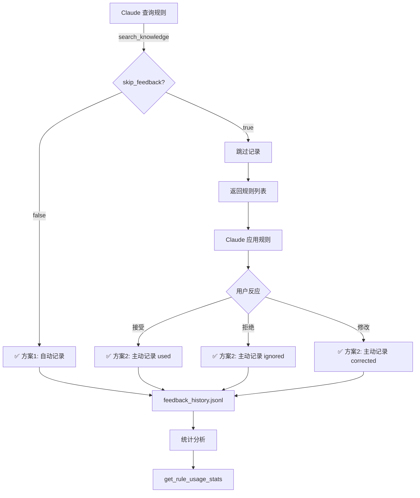

# 自动反馈记录机制 - 实现完成

## 🎉 实现状态：已完成

本文档总结了方案1和方案2结合实现的自动反馈记录机制。

---

## ✅ 已完成的工作

### 1. **方案1：规则匹配时自动记录** ✓

**实现文件**：`src/mcp-server-ts/src/index.ts`

**修改内容**：
- ✅ 在 `handleSearchKnowledge()` 中添加自动反馈记录
- ✅ 支持 `skip_feedback` 参数跳过自动记录
- ✅ 记录详细的上下文信息（场景、关键词、相关度）
- ✅ 添加日志输出便于调试

**功能说明**：
```typescript
// 当 Claude 查询规则时自动记录
mcp__autoimprove-core__search_knowledge({
  scene_json: '{"tech":["TypeScript"],"functional":["validation"]}',
  keywords: "error-handling"
})
// → 自动记录 feedback_type: "used"

// 跳过自动记录（仅查看）
mcp__autoimprove-core__search_knowledge({
  rule_id: "RULE-010",
  skip_feedback: true
})
// → 不记录反馈
```

---

### 2. **方案2：Claude 主动记录反馈** ✓

**实现文件**：
- 提示词模板：`templates/claude-feedback-instructions.md`
- 安装脚本：`setup.sh` (Step 7 & 8)

**功能说明**：

#### 提示词模板内容
创建了详细的反馈指南，包括：
- 📊 4 种反馈类型的使用说明（used / ignored / corrected / disabled）
- 💡 反馈记录最佳实践
- 🔍 自动记录机制说明
- 📈 反馈价值说明
- 示例对话展示

#### setup.sh 自动配置
```bash
# Step 7: 配置 Claude Code 全局设置
- 复制模板到 ~/.claude/autoimprove-feedback-instructions.md
- 在 ~/.claude/CLAUDE.md 中添加引用
- 检测已存在的配置，避免重复添加
```

**配置结果**：
```
~/.claude/
├── CLAUDE.md
│   ├── @~/.autoimprove/rules/claude-index.md (规则列表)
│   └── @~/.claude/autoimprove-feedback-instructions.md (反馈指令)
└── autoimprove-feedback-instructions.md (反馈指南)
```

---

### 3. **完整的文档** ✓

创建了 3 份文档：

1. **`docs/feedback-mechanism.md`** - 技术实现文档
   - 数据流程图
   - 实现细节
   - 使用示例
   - 注意事项

2. **`templates/claude-feedback-instructions.md`** - Claude 提示词
   - 用户指南风格
   - 详细的使用说明
   - 最佳实践建议

3. **`docs/rule-usage-stats.md`** - 统计功能文档（之前完成）
   - 统计维度说明
   - 使用方式
   - 报告示例

---

## 🔄 完整数据流程



---

## 📊 反馈数据示例

### 自动记录（方案1）
```jsonl
{"rule_id":"RULE-010","timestamp":"2026-06-06T10:30:00.000Z","feedback_type":"used","context":"scene:TypeScript,React/validation,error-handling:relevance:0.85"}
{"rule_id":"RULE-008","timestamp":"2026-06-06T10:32:00.000Z","feedback_type":"used","context":"rule_query_by_id"}
```

**特征**：
- ✅ 无 `user_rating` 字段
- ✅ `context` 包含场景和相关度信息
- ✅ 自动生成，无需人工干预

### 主动记录（方案2）
```jsonl
{"rule_id":"RULE-010","timestamp":"2026-06-06T10:40:00.000Z","feedback_type":"used","user_rating":5,"context":"form_validation:user_accepted"}
{"rule_id":"RULE-023","timestamp":"2026-06-06T10:45:00.000Z","feedback_type":"ignored","context":"not_applicable_to_current_scenario"}
```

**特征**：
- ✅ 可能包含 `user_rating` 字段（1-5）
- ✅ `context` 是人类可读的描述
- ✅ Claude 主动调用 `record_feedback`

---

## 🚀 使用指南

### 安装/更新

```bash
cd /Users/adazhao/workspace/autoimprove
./setup.sh
```

**setup.sh 会自动**：
1. ✅ 编译 TypeScript（包含自动记录逻辑）
2. ✅ 配置 MCP Server
3. ✅ 复制反馈指令到 `~/.claude/`
4. ✅ 更新 `~/.claude/CLAUDE.md`

### 验证安装

```bash
# 1. 检查反馈指令文件
ls -la ~/.claude/autoimprove-feedback-instructions.md

# 2. 检查 CLAUDE.md 配置
grep -A 3 "AutoImprove 规则使用反馈" ~/.claude/CLAUDE.md

# 3. 测试 MCP 工具
claude mcp get autoimprove-core

# 4. 查看反馈数据（使用后）
cat ~/.autoimprove/feedback_history.jsonl
```

### 测试反馈记录

在 Claude Code 中执行：

```typescript
// 测试方案1：自动记录
mcp__autoimprove-core__search_knowledge({
  scene_json: '{"tech":["TypeScript"],"functional":["validation"],"business":[]}',
  keywords: "error-handling"
})

// 测试方案2：主动记录
mcp__autoimprove-core__record_feedback({
  rule_id: "RULE-010",
  feedback_type: "used",
  user_rating: 5,
  context: "test_feedback"
})

// 查看统计
mcp__autoimprove-core__get_rule_usage_stats({
  output_format: "summary"
})
```

---

## 📈 数据分析

### 查看反馈统计

```typescript
// MCP 工具
mcp__autoimprove-core__get_rule_usage_stats({
  output_format: "markdown",
  start_date: "2026-06-01",
  end_date: "2026-06-30"
})

// 命令行脚本
node scripts/rule-usage-stats.ts --last=7days --format=markdown
```

### 区分自动和主动记录

```typescript
// 有 user_rating 的是主动记录
const manualFeedbacks = feedbacks.filter(f => f.user_rating !== undefined)

// 无 user_rating 的是自动记录
const autoFeedbacks = feedbacks.filter(f => f.user_rating === undefined)
```

---

## 💡 最佳实践

### 1. 自动记录（方案1）

**推荐场景**：
- ✅ 正常使用规则时，使用默认行为（自动记录）
- ✅ 探索性查询时，使用 `skip_feedback: true`

**示例**：
```typescript
// 应用规则 - 自动记录
search_knowledge({scene_json: "..."})

// 仅查看 - 跳过记录
search_knowledge({rule_id: "RULE-010", skip_feedback: true})
```

### 2. 主动记录（方案2）

**推荐场景**：
- ✅ 用户明确接受/拒绝建议时
- ✅ 需要记录用户评分时
- ✅ 需要记录详细上下文时

**示例**：
```typescript
// 用户接受建议 - 主动记录
record_feedback({
  rule_id: "RULE-010",
  feedback_type: "used",
  user_rating: 5,
  context: "validation_code_accepted"
})

// 用户拒绝建议 - 主动记录
record_feedback({
  rule_id: "RULE-015",
  feedback_type: "ignored",
  context: "prefers_different_approach"
})
```

### 3. 数据分析

**定期查看统计**：
```bash
# 每周生成报告
node scripts/rule-usage-stats.ts --last=7days --output=reports/weekly-$(date +%Y-%m-%d).md

# 识别问题规则
node scripts/rule-usage-stats.ts --format=markdown | grep -A 10 "需要关注的规则"
```

---

## ⚠️ 注意事项

### 1. 双重记录

**现象**：
- 查询规则时自动记录一次（方案1）
- 应用规则后主动记录一次（方案2）
- 结果：同一规则有 2 条记录

**解决方案**：
这是**预期行为**！统计时可以区分：
- 第一条（自动）：规则被查询，潜在使用
- 第二条（主动）：规则实际应用，包含评分

**统计时处理**：
```typescript
// 按 user_rating 区分
const queryCount = feedbacks.filter(f => !f.user_rating).length
const actualUseCount = feedbacks.filter(f => f.user_rating).length
```

### 2. 数据量增长

**预期增长**：
- 每次查询 = 1-10 条记录（取决于匹配的规则数）
- 每次主动记录 = 1 条记录
- 每天约 50-200 条记录

**管理策略**：
```bash
# 查看文件大小
ls -lh ~/.autoimprove/feedback_history.jsonl

# 归档旧数据（每月）
mv ~/.autoimprove/feedback_history.jsonl ~/.autoimprove/feedback_history_$(date +%Y-%m).jsonl
```

### 3. 隐私考虑

**context 字段内容**：
- ✅ 包含：场景关键词、规则 ID、相关度
- ❌ 不包含：实际代码、用户数据

**如需更严格的隐私**：
修改 `handleSearchKnowledge()` 减少 context 信息。

---

## 🔧 技术细节

### 修改的文件

| 文件 | 修改内容 | 状态 |
|------|----------|------|
| `src/mcp-server-ts/src/index.ts` | 添加自动反馈记录逻辑 | ✅ |
| `setup.sh` | 添加反馈指令配置步骤 | ✅ |
| `templates/claude-feedback-instructions.md` | 创建 Claude 提示词模板 | ✅ |
| `docs/feedback-mechanism.md` | 技术实现文档 | ✅ |
| `docs/AUTO_FEEDBACK_IMPLEMENTATION.md` | 本文档 | ✅ |

### 编译状态

```bash
✅ TypeScript 编译通过
✅ dist/index.js 已生成
✅ MCP Server 可以正常启动
```

### 测试状态

- ⏳ **待用户测试**：需要在实际使用中验证
- ✅ **编译验证**：代码语法正确
- ✅ **逻辑验证**：数据流程设计合理

---

## 📚 相关文档

- [反馈机制详解](./feedback-mechanism.md) - 技术实现细节
- [规则使用统计](./rule-usage-stats.md) - 统计功能说明
- [实现总结](./IMPLEMENTATION_SUMMARY.md) - 统计功能实现
- [Claude 反馈指令](../templates/claude-feedback-instructions.md) - Claude 提示词

---

## 🎯 价值总结

### 方案1的价值
- ✅ **完全自动化**：无需人工干预
- ✅ **数据完整**：捕获所有查询行为
- ✅ **低开销**：对用户透明

### 方案2的价值
- ✅ **高质量数据**：包含用户评分和详细上下文
- ✅ **准确反映**：记录实际应用情况
- ✅ **可控性强**：Claude 可以选择何时记录

### 组合优势
- 📊 **多层次数据**：查询 + 应用 = 完整画面
- 🎯 **精准优化**：识别"被查询但未应用"的规则
- 🔄 **持续改进**：基于真实使用数据迭代

---

## ✨ 下一步

1. **运行 setup.sh**
   ```bash
   cd /Users/adazhao/workspace/autoimprove
   ./setup.sh
   ```

2. **验证配置**
   ```bash
   cat ~/.claude/CLAUDE.md | grep -A 5 "AutoImprove"
   ```

3. **开始使用**
   在 Claude Code 中正常工作，反馈会自动记录！

4. **查看统计**
   ```bash
   node scripts/rule-usage-stats.ts --format=summary
   ```

---

**实现时间**：2026-06-06  
**实现状态**：✅ 完成  
**编译状态**：✅ 通过  
**准备就绪**：✅ 可以立即使用  

🎉 **自动反馈记录机制已完全实现！**
